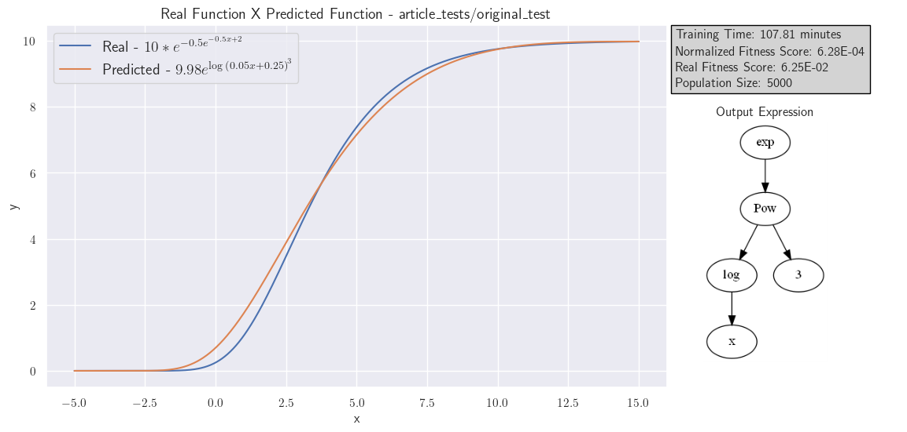
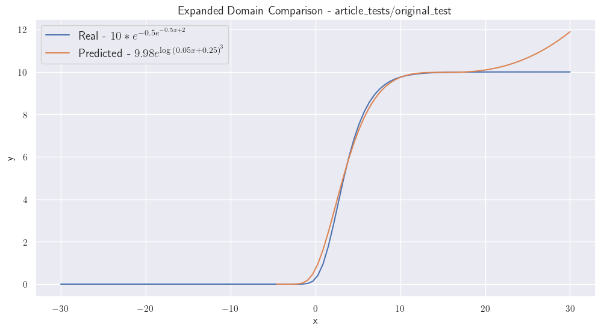
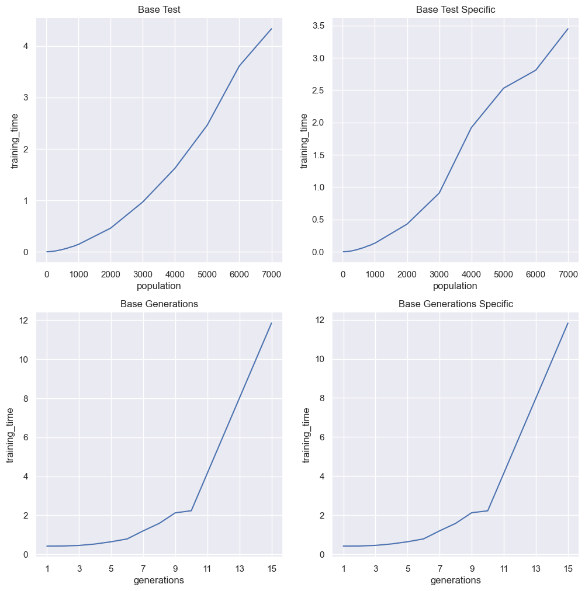
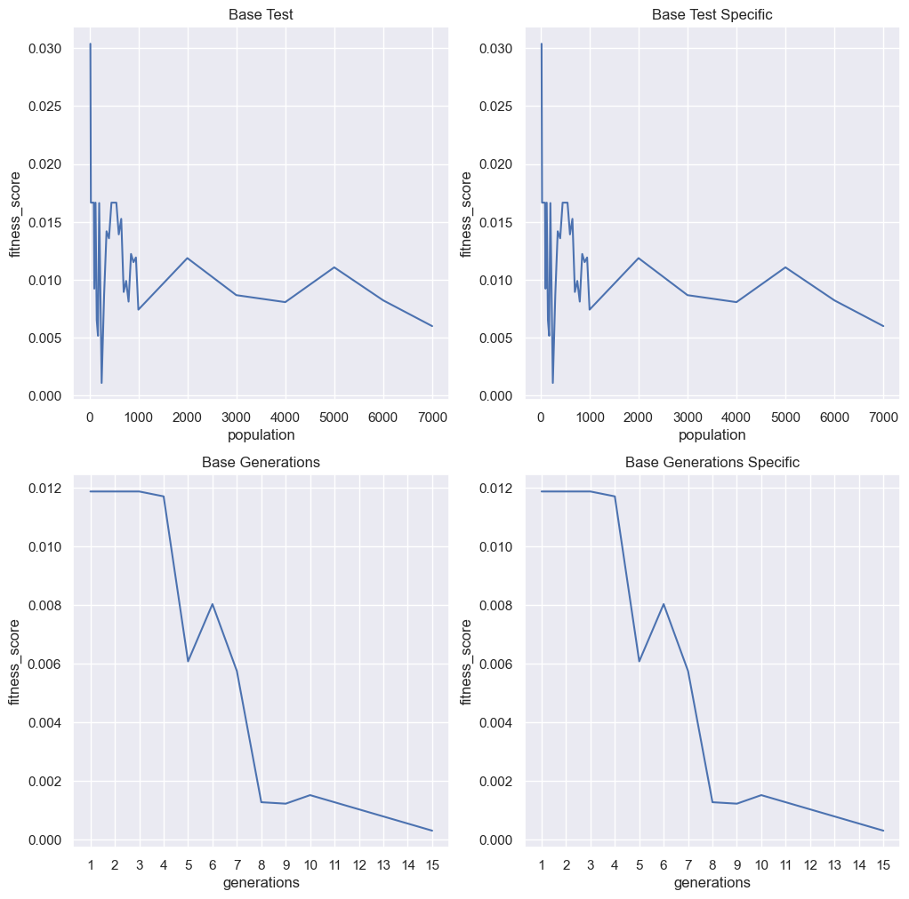
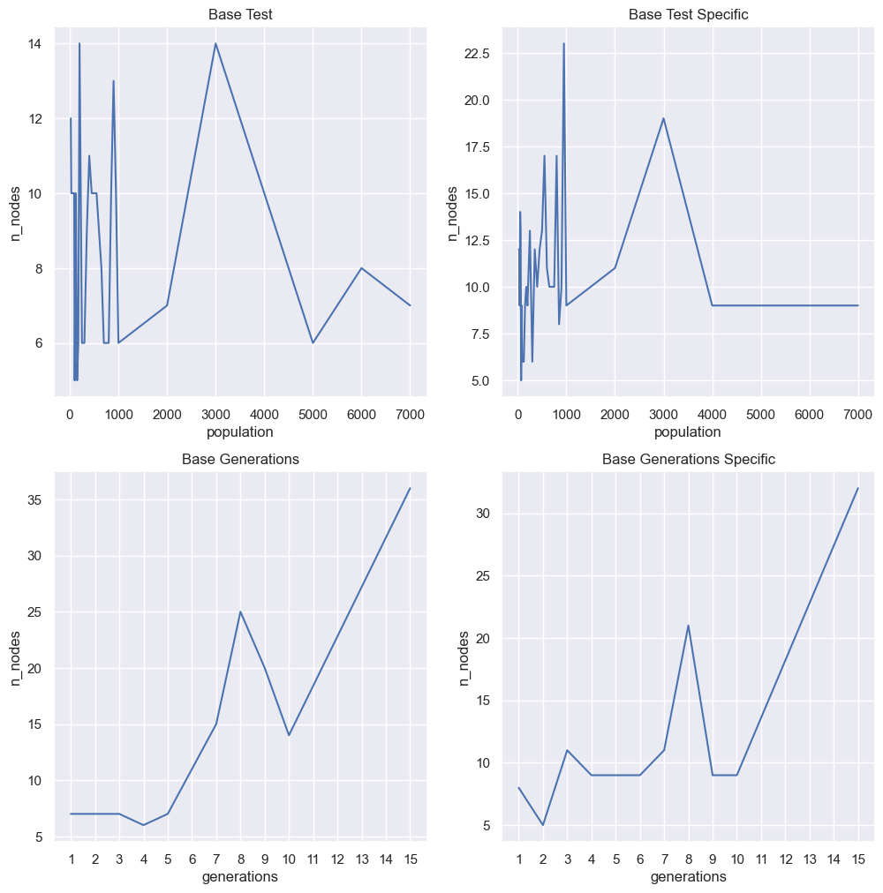
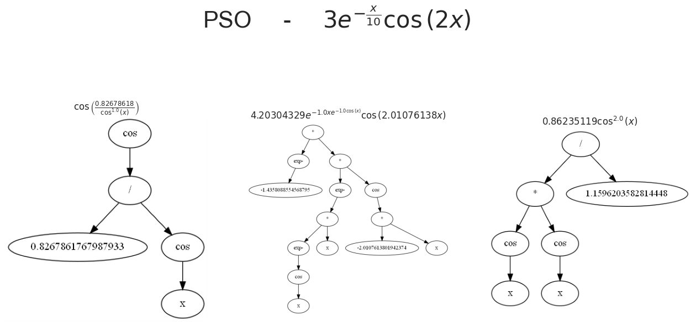

# CSOWP-SR: Constant Swarm with Operator Weighted Pruning

A custom symbolic regression engine inspired by the work of [Korns (2013)](https://github.com/user-attachments/files/17723430/Korns.-.2013.-.A.Baseline.Symbolic.Regression.Algorithm.pdf) and significantly extended by the author to include new features, enhanced interpretability, and large-scale parallel capabilities.

CSOWP-SR is a symbolic regression algorithm that uses an evolutionary strategy to discover mathematical expressions that best describe a dataset—both in structure and in constants. It is designed for white-box modeling of real-world data where interpretability, generalization, and robustness are key.

> 🧠 Symbolic Regression builds models by evolving symbolic expressions (like formulas), instead of fitting parameters to a predefined function.  
> This enables interpretable, human-readable equations derived directly from data.

  
  
<em>Evolutionary search process used to evolve symbolic expressions.</em>

While this project does not aim to compete with cutting-edge libraries like PySR or gplearn, it has produced promising and insightful results—leading to the development of a scientific publication currently in preparation.

---

## 🔍 Key Features

- 🧮 **White-box modeling** using symbolic regression  
- 🔁 **Evolutionary algorithm** with operator-weighted pruning and constant optimization  
- ⚡ **Parallel execution support** for large-scale benchmarking  
- 📈 **Automatic analysis and visualization** of results  
- 🧪 **Physics-inspired test cases** (e.g., projectile motion, damped pendulum)  
- 🧠 Ideal for interpretable machine learning and scientific discovery  

---

## 📂 Repository Structure

The codebase is modular and located in the `algorithms/` directory, split into the following key components:

- **`CSOWP_SR/`** – Core symbolic regression engine (~2000+ lines), including the main evolutionary logic and user interface  
- **`ExpressionTree/`** – Defines the tree-based structure for symbolic expressions  
- **`Utils/`** – A utility library with tools for data generation, expression parsing (with SymPy), and math operations  
- **`TrainAlgorithm/`** & **`TrainSR/`** – Enable scalable training and evaluation, including support for HPC cluster execution  
- **`AnalyseAlgorithm/`** – Automates a wide range of post-processing tasks for experiments and result interpretation  

The `parallel_algorithms/` directory contains example scripts for running experiments in parallel environments (e.g., SLURM clusters).

---

## 📊 Model Evaluation & Analysis

To evaluate the performance, scalability, and generalization ability of CSOWP-SR, a series of controlled experiments were conducted. These experiments aimed to uncover the model's behavior under varying hyperparameter configurations, as well as its capacity to discover meaningful symbolic representations in noisy or sparse datasets.

The Jupyter notebooks `data_analysis_build_up.ipynb` and `Analysis.ipynb` provide a comprehensive walkthrough of these tests, including:

- 📏 Trade-offs between model accuracy and expression complexity  
- 📉 Sensitivity to noise, sparsity, and data irregularities  
- 🌿 Expression compactness and tree structure redundancy  
- 🧪 Performance of custom metrics including interpretability and generalization  

---

### 🔍 Expression Validation

The figures below present a typical output of the model, comparing predicted vs. real data and visualizing the evolved expression’s complexity, structure, parameters, and performance (MSE).  

  
  

---

### ⏱️ Training Time vs. Hyperparameters

Training time was analyzed as a function of **population size** and **number of generations**. The plots below show how these parameters impact computation cost under different constraints:

  

Key insights:
- Both population size and generation count scale training time exponentially (logarithmic y-axis).
- Increasing generations has a **stronger effect** on time than increasing population size.
- Reducing the search space (e.g., limiting basis functions) leads to faster convergence.

---

### 🎯 Fitness (MSE) vs. Hyperparameters

This plot tracks the model’s fitness (mean squared error) under the same variation of parameters:

  

Observations:
- Increasing **generations** significantly improves fitness—allowing the model to explore deeper solutions.
- Increasing **population size** offers diminishing returns after a certain point, forming a performance plateau.
- These trends suggest that longer evolutionary searches (more generations) can improve accuracy, but also risk **overfitting**.

---

### 🌲 Expression Size and Overfitting

To validate the overfitting hypothesis, we analyzed how expression size (number of nodes in the expression tree) grows with training parameters:

  

Findings:
- Expression size increases sharply with the number of generations—correlating with improved fitness but also potential overfitting.
- Population size has a **less predictable effect**, often stabilizing around a plateau.

---

### 🧬 Example of Discovered Solutions

Here we show actual symbolic expressions evolved by the model for a test problem. In this case, **Particle Swarm Optimization (PSO)** was used to refine constants during evolution:

  

This figure highlights how CSOWP-SR combines structural search (tree evolution) with parameter optimization to discover interpretable mathematical models.

📁 All datasets and configuration scripts used in these experiments are available in the `Generating_results/` directory.

---

## 🎓 Research Applications

As an early application, CSOWP-SR was used to model basic physical systems. These proof-of-concept demonstrations served as both validation and educational tools:

### 📐 Projectile Motion  

### 🌀 Damped Pendulum  

These experiments were featured in a research seminar and mark the beginning of the framework's potential application to more complex real-world systems.

---

## 📘 Related Publication

A scientific paper describing the algorithm and proposing a new metric for evaluating symbolic regression models is currently under development and will be published on arXiv. Once available, this repository will be updated with:

- 📂 A public dataset and benchmark  
- 📄 The full paper and citation  
- 📊 Example result comparisons  

---

## 🚀 Getting Started (Coming Soon)

Installation instructions, usage examples, and benchmarks will be added upon release of the final version. In the meantime, feel free to explore the code and notebooks or reach out with questions.

---

## 🧑‍💻 Author

Developed by **Luiz Guilherme Ataliba dos Reis**, a computational physicist and machine learning researcher.  
For more, visit [LinkedIn](https://www.linkedin.com/) or follow updates on the paper release.
